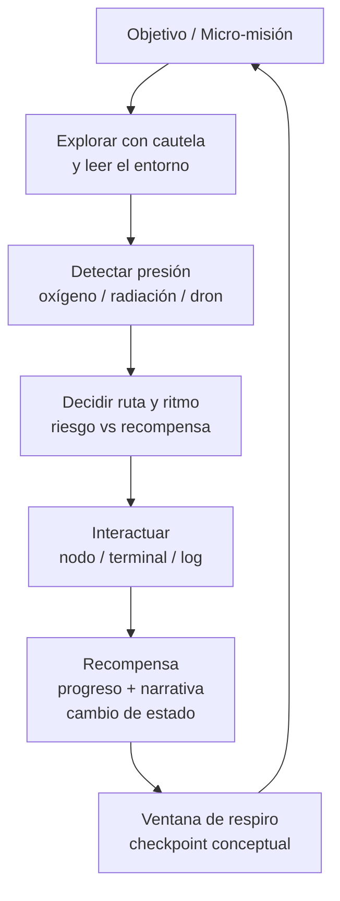

# Core Loop — DERIVA (v1)

```mermaid
flowchart TD
    A["Objetivo / Micro-misión"]
    B["Explorar con cautela<br/>y leer el entorno"]
    C["Detectar presión<br/>oxígeno / radiación / dron"]
    D["Decidir ruta y ritmo<br/>riesgo vs recompensa"]
    E["Interactuar<br/>nodo / terminal / log"]
    F["Recompensa<br/>progreso + narrativa<br/>cambio de estado"]
    G["Ventana de respiro<br/>checkpoint conceptual"]

    A --> B --> C --> D --> E --> F --> G
    G --> A

```

# Notas:
- Dron = presión constante
- Criatura = evento/pico controlado