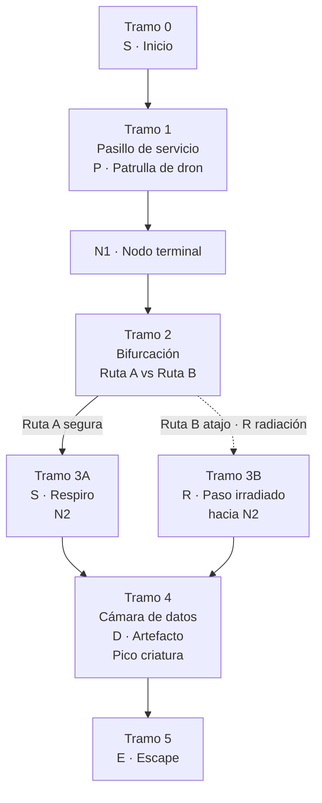

# Layout 2D (ASCII) - Vertical Slice (Nave)

## Leyenda:
- [S] Zona segura / checkpoint conceptual
- [N1], [N2] Nodos/terminales (micro-objetivos)
- [D] Cámara de datos (artefacto)
- [E] Escape (fin del slice)
- (R) Zona de radiación visible (exposición gradual)
- ---> Flujo recomendado
- "~~~" Ruta alternativa / riesgo vs recompensa
- {P} Patrulla típica del dron

# Notas:
- El dron patrulla fuerte en Tramo 1 y puede investigar Tramo 3/4.
- La radiación es visible, gradual y usada solo para decisiones (no castigo injusto).